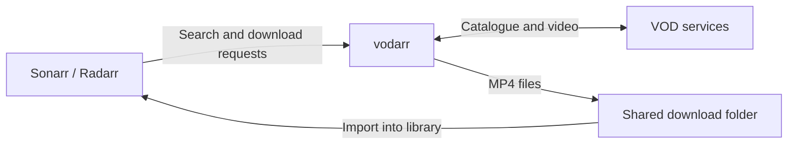

<h1 align="center">vodarr</h1>

<p align="center">
  <strong>Bring VOD to your Sonarr and Radarr library.</strong>
</p>

<p align="center">
  <a href="https://github.com/combor/vodarr/actions/workflows/ci.yml"></a>
  <a href="LICENSE"></a>
  <a href="https://github.com/combor/vodarr/releases/latest"></a>
</p>

<p align="center">
  <a href="#quick-start">Quick start</a> ·
  <a href="#how-it-works">How it works</a> ·
  <a href="docs/usage.md#configuration">Configuration</a> ·
  <a href="docs/usage.md#troubleshooting">Troubleshooting</a> ·
  <a href="https://github.com/combor/vodarr/issues">Report an issue</a>
</p>

Search and download movies and TV shows from video-on-demand services through
your existing Sonarr or Radarr setup. vodarr provides both a Newznab indexer and
a SABnzbd-compatible download client, so you do not need a separate SABnzbd
installation.

Currently supported: **TVP VOD**. More providers are planned.

## How it works



Add vodarr as an indexer to search a provider's catalogue and as a download client
to fetch the video. Sonarr and Radarr track progress and import the finished files.

## Quick start

Install [Docker with Compose](https://docs.docker.com/compose/install/). The
container image includes ffmpeg.

Download the [Compose configuration](compose.yaml) and environment template:

```sh
mkdir vodarr
cd vodarr
curl -fsSLO https://raw.githubusercontent.com/combor/vodarr/main/compose.yaml
curl -fsSL https://raw.githubusercontent.com/combor/vodarr/main/.env.example -o .env
mkdir -p downloads
```

Edit `.env` before starting:

- Set `VODARR_API_KEY` to a long, random key. Use this same key in both Sonarr/Radarr connections.
- Set `VODARR_DOWNLOAD_PATH` to your shared download folder, or keep `./downloads`.
- On Linux, set `VODARR_UID` and `VODARR_GID` to the IDs of the account that owns
  that folder. Run `id -u` and `id -g` to check your current account's IDs.

Start vodarr:

```sh
docker compose up -d
```

Compose pulls `ghcr.io/combor/vodarr:latest` and exposes the APIs on port **8484**.
Continue below to connect your apps. For a native installation, see the
[Linux service](docs/usage.md#linux-service) or
[building from source](docs/usage.md#build-from-source).

## Connect Sonarr and Radarr

In each app, add these two connections using the API key from `.env`:

1. **Download client:** open **Settings → Download Clients**, add **SABnzbd** and
   name it `vodarr`. Enter vodarr's host and port `8484`. Set the category to `tv`
   in Sonarr or `movies` in Radarr.
2. **Indexer:** open **Settings → Indexers** and add **Newznab**. For TVP VOD,
   use `http://<vodarr-host>:8484/tvp` with API path `/api`. Select categories
   `5000, 5040` in Sonarr or `2000, 2040` in Radarr. Set **Download Client** to
   the `vodarr` client from step 1.
3. Click **Test** on both connections, then **Save**. Search for a movie or show
   from Sonarr or Radarr to get started.

Use a host address reachable from your apps, and make sure both can read the
download folder. See [Docker networking and shared downloads](docs/usage.md#docker-networking-and-shared-downloads)
for container hostnames, volume mounts and Remote Path Mappings.

## Help and contributing

- [Setup and configuration](docs/usage.md): installation options and settings.
- [Troubleshooting](docs/usage.md#troubleshooting): help with connections and downloads.
- [GitHub Issues](https://github.com/combor/vodarr/issues): report a bug or suggest an improvement.
- [Add a provider](docs/usage.md#adding-a-site) or follow the [development guide](docs/usage.md#development)
  to contribute code. Documentation improvements are welcome too.

## License

vodarr is available under the [BSD-3-Clause license](LICENSE).
