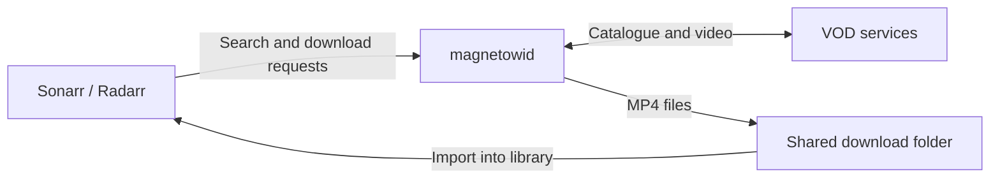

<h1 align="center">magnetowid</h1>

<p align="center">
  <strong>VOD downloads for Sonarr and Radarr.</strong>
</p>

<p align="center">
  <a href="https://github.com/combor/magnetowid/actions/workflows/ci.yml"></a>
  <a href="LICENSE"></a>
  <a href="https://github.com/combor/magnetowid/releases/latest"></a>
</p>

<p align="center">
  <a href="#quick-start">Quick start</a> ·
  <a href="#how-it-works">How it works</a> ·
  <a href="docs/usage.md#configuration">Configuration</a> ·
  <a href="docs/usage.md#troubleshooting">Troubleshooting</a> ·
  <a href="https://github.com/combor/magnetowid/issues">Report an issue</a>
</p>

magnetowid searches and downloads video-on-demand movies and series through
Sonarr and Radarr. It provides a Newznab indexer and a SABnzbd-compatible
download client. No separate SABnzbd installation is needed.

Supported: **TVP VOD** and **BBC iPlayer**.

## How it works



## Quick start

Install [Docker with Compose](https://docs.docker.com/compose/install/). The
container image includes ffmpeg.

Download the [Compose configuration](compose.yaml) and environment template:

```sh
mkdir magnetowid
cd magnetowid
curl -fsSLO https://raw.githubusercontent.com/combor/magnetowid/main/compose.yaml
curl -fsSL https://raw.githubusercontent.com/combor/magnetowid/main/.env.example -o .env
mkdir -p downloads
```

Edit `.env` before starting:

- Set `MAGNETOWID_API_KEY` to a long, random key. Use this same key in both Sonarr/Radarr connections.
- Set `MAGNETOWID_DOWNLOAD_PATH` to your shared download folder, or keep `./downloads`.
- On Linux, set `MAGNETOWID_UID` and `MAGNETOWID_GID` to the IDs of the account that owns
  that folder. Run `id -u` and `id -g` to check your current account's IDs.

Start magnetowid:

```sh
docker compose up -d
```

Compose pulls `ghcr.io/combor/magnetowid:latest` and exposes the APIs on port **8484**.
For a native installation, see the
[Linux service](docs/usage.md#linux-service) or
[building from source](docs/usage.md#build-from-source).

## Connect Sonarr and Radarr

In each app, add these two connections using the API key from `.env`:

1. **Download client:** open **Settings → Download Clients**, add **SABnzbd** and
   name it `magnetowid`. Enter magnetowid's host and port `8484`. Set the
   category to `tv` in Sonarr or `movies` in Radarr.
2. **Indexer:** open **Settings → Indexers** and add **Newznab**, one per site.
   For TVP VOD, use `http://<magnetowid-host>:8484/tvp` with API path `/api`;
   for BBC iPlayer, `http://<magnetowid-host>:8484/bbc`. Select categories
   `5000, 5040` in Sonarr or `2000, 2040` in Radarr. Set **Download Client** to
   the `magnetowid` client from step 1.
3. **Test** and **Save** both connections, then search from Sonarr or Radarr.

Use a host address reachable from your apps, and make sure both can read the
download folder. See [Docker networking and shared downloads](docs/usage.md#docker-networking-and-shared-downloads)
for container hostnames, volume mounts and Remote Path Mappings.

## Web interface

Open `http://<magnetowid-host>:8484/` and sign in with the API key to watch the
download queue: the current download's progress, what's next, and any retries.
See [Web interface](docs/usage.md#web-interface).

## Help and contributing

- [Setup and configuration](docs/usage.md): installation options and settings.
- [Troubleshooting](docs/usage.md#troubleshooting): help with connections and downloads.
- [GitHub Issues](https://github.com/combor/magnetowid/issues): report a bug or suggest an improvement.
- [Add a provider](docs/usage.md#adding-a-site) or use the [development guide](docs/usage.md#development).

## License

[BSD-3-Clause](LICENSE).
