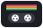
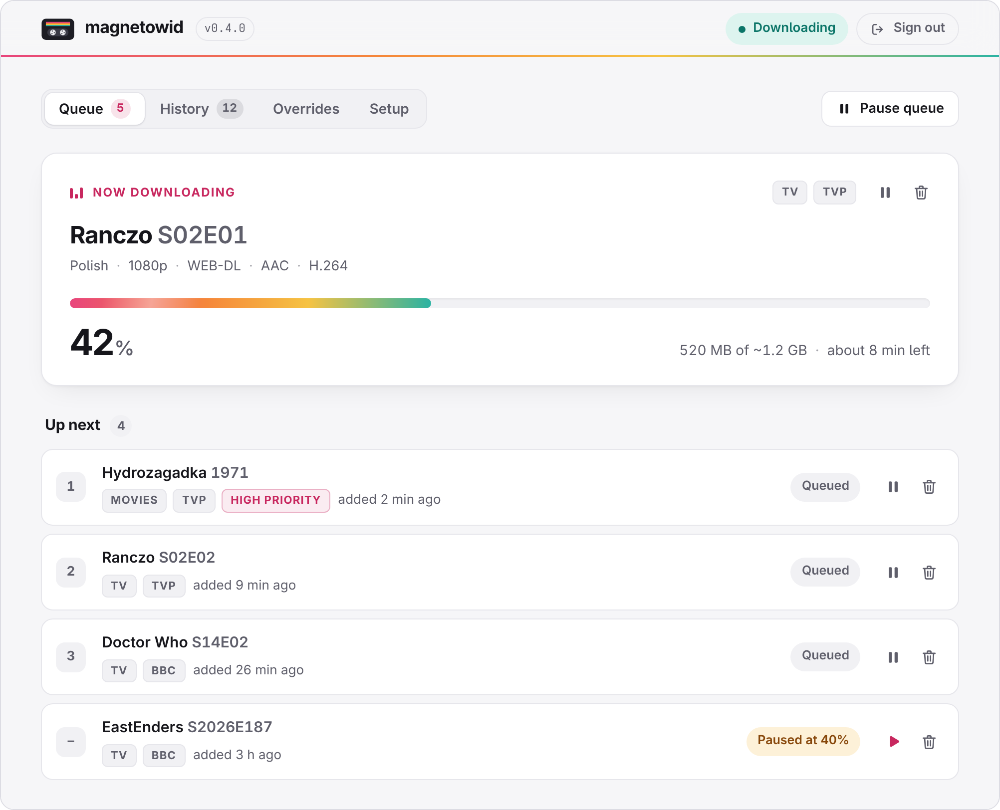
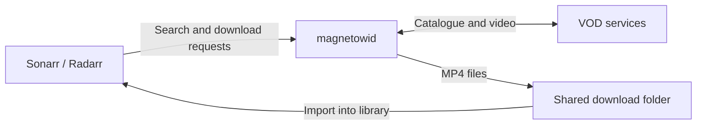
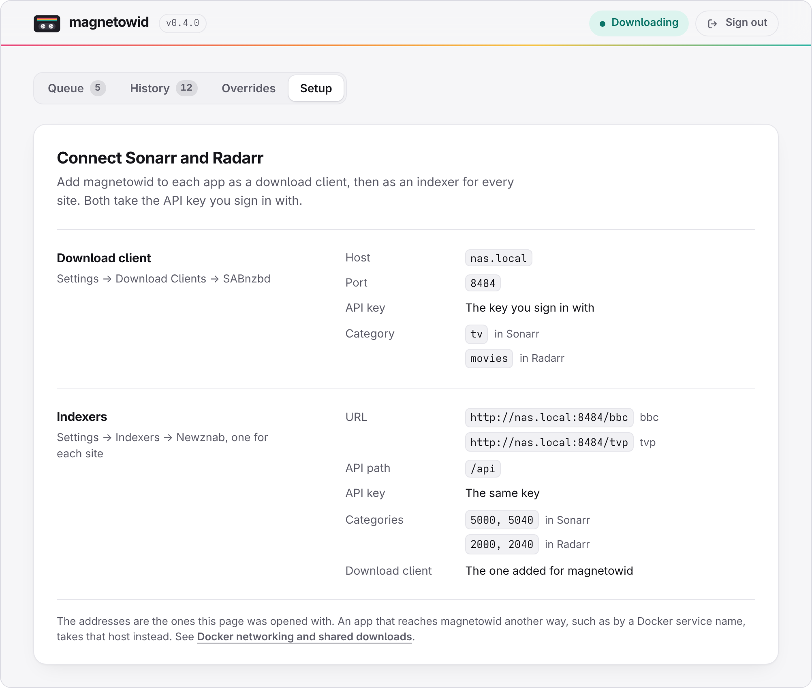

<p align="center">
  <picture>
    <source media="(prefers-color-scheme: dark)" srcset="docs/images/logo-dark.svg">
    
  </picture>
</p>

<h1 align="center">magnetowid</h1>

<p align="center">
  <strong>VOD downloads for Sonarr and Radarr.</strong>
</p>

<p align="center">
  <a href="https://github.com/combor/magnetowid/actions/workflows/ci.yml"></a>
  <a href="https://github.com/combor/magnetowid/releases/latest"></a>
  <a href="LICENSE"></a>
</p>

<p align="center">
  <a href="#quick-start">Quick start</a> ·
  <a href="#connect-sonarr-and-radarr">Connect your apps</a> ·
  <a href="#web-interface">Web interface</a> ·
  <a href="docs/usage.md">Documentation</a> ·
  <a href="docs/usage.md#troubleshooting">Troubleshooting</a>
</p>

<p align="center">
  <picture>
    <source media="(prefers-color-scheme: dark)" srcset="docs/images/queue-dark.png">
    
  </picture>
</p>

magnetowid brings video-on-demand sites to Sonarr and Radarr. Search for a
series or a film as you always do, and it arrives in your library as an MP4
file, with subtitles.

To your apps it is an ordinary indexer and download client: a Newznab indexer
for each site, and a SABnzbd-compatible client that does the downloading
itself. No separate SABnzbd installation is needed.

## Supported sites

| Site | Indexer | Good to know |
|---|---|---|
| **TVP VOD** | `/tvp` | Polish series and films. Streams may need a Polish connection. [TVP VOD notes](internal/provider/tvp/README.md) |
| **BBC iPlayer** | `/bbc` | Streams need a UK connection. [BBC iPlayer notes](internal/provider/bbc/README.md) |

Only what a site offers for free is found: DRM-protected, paid and
region-blocked streams are left out of the results. To use a site from another
country, give it a VPN exit: see [Region-locked sites](docs/vpn.md).

## What you get

- **Search and RSS.** Sonarr and Radarr search each site and pick up new
  episodes and newly available films on their own.
- **Releases named like any other.** Names carry the resolution, codecs and
  audio language, so your quality and language profiles keep working.
- **Subtitles.** Saved beside the video as SRT, labelled with their language.
- **Downloads that pick up where they stopped.** Pause one, restart
  magnetowid or lose the connection, and it continues from the last segment.
- **A web interface.** Watch the queue, pause and remove downloads, and browse
  the history.
- **Overrides.** When a title is missed or episodes are paired wrongly,
  correct the match yourself.

## How it works



## Quick start

You need [Docker with Compose](https://docs.docker.com/compose/install/). The
container image includes ffmpeg.

**1. Get the configuration.** Download the [Compose file](compose.yaml) and the
environment template:

```sh
mkdir magnetowid
cd magnetowid
curl -fsSLO https://raw.githubusercontent.com/combor/magnetowid/main/compose.yaml
curl -fsSL https://raw.githubusercontent.com/combor/magnetowid/main/.env.example -o .env
mkdir -p downloads
```

**2. Edit `.env`.**

| Setting | What to enter |
|---|---|
| `MAGNETOWID_API_KEY` | A long, random key. Sonarr and Radarr use the same one. |
| `MAGNETOWID_DOWNLOAD_PATH` | Your shared download folder, or keep `./downloads`. |
| `MAGNETOWID_UID`, `MAGNETOWID_GID` | On Linux, the IDs of the account that owns that folder. `id -u` and `id -g` show yours. |

**3. Start magnetowid.**

```sh
docker compose up -d
```

Compose pulls `ghcr.io/combor/magnetowid:latest` and serves everything on port
**8484**.

Not using Docker? Install the [Linux service](docs/usage.md#linux-service) from
the `.deb`, `.rpm` or AUR package, or
[build from source](docs/usage.md#build-from-source).

## Connect Sonarr and Radarr

Open `http://<magnetowid-host>:8484/`, sign in with the API key and go to
**Setup**. The page lists the values for your install, ready to copy.

<p align="center">
  <picture>
    <source media="(prefers-color-scheme: dark)" srcset="docs/images/setup-dark.png">
    
  </picture>
</p>

In each app, add two connections with the API key from `.env`:

1. **Download client.** Under **Settings → Download Clients**, add **SABnzbd**
   and name it `magnetowid`. Enter magnetowid's host and port `8484`. Set the
   category to `tv` in Sonarr or `movies` in Radarr.
2. **Indexers.** Under **Settings → Indexers**, add **Newznab**, one for each
   site: `http://<magnetowid-host>:8484/tvp` for TVP VOD and
   `http://<magnetowid-host>:8484/bbc` for BBC iPlayer, both with API path
   `/api`. Select categories `5000, 5040` in Sonarr or `2000, 2040` in Radarr,
   and set **Download Client** to the `magnetowid` client from step 1.
3. **Test** and **Save** both, then search from Sonarr or Radarr.

> [!NOTE]
> Use a host address your apps can reach, and make sure they can read the
> download folder. [Docker networking and shared downloads](docs/usage.md#docker-networking-and-shared-downloads)
> covers container hostnames, volume mounts and Remote Path Mappings.

## Web interface

Open `http://<magnetowid-host>:8484/` and sign in with the API key.

| Page | What it is for |
|---|---|
| **Queue** | The running download's progress and time left, and what is up next. Pause, resume or remove downloads. |
| **History** | Finished and failed downloads from the last 30 days, with the error of any that failed. |
| **Overrides** | Forms to [correct a match](docs/usage.md#correcting-matches) for a series or a film. |
| **Setup** | The values to enter in Sonarr and Radarr, and whether each site is reachable. |

See [Web interface](docs/usage.md#web-interface) for the details.

## Documentation

- [Setup and configuration](docs/usage.md): installation options and every setting.
- [Region-locked sites](docs/vpn.md): a VPN exit for each site's country.
- [Correcting matches](docs/usage.md#correcting-matches): overrides for titles, seasons and single episodes.
- [Troubleshooting](docs/usage.md#troubleshooting): help with connections, downloads and imports.
- [Limitations](docs/usage.md#limitations): what magnetowid can't do.
- [Adding a site](docs/usage.md#adding-a-site) and the [development guide](docs/usage.md#development).

Found a bug or missing something? [Open an issue](https://github.com/combor/magnetowid/issues).

## License

[BSD-3-Clause](LICENSE).
